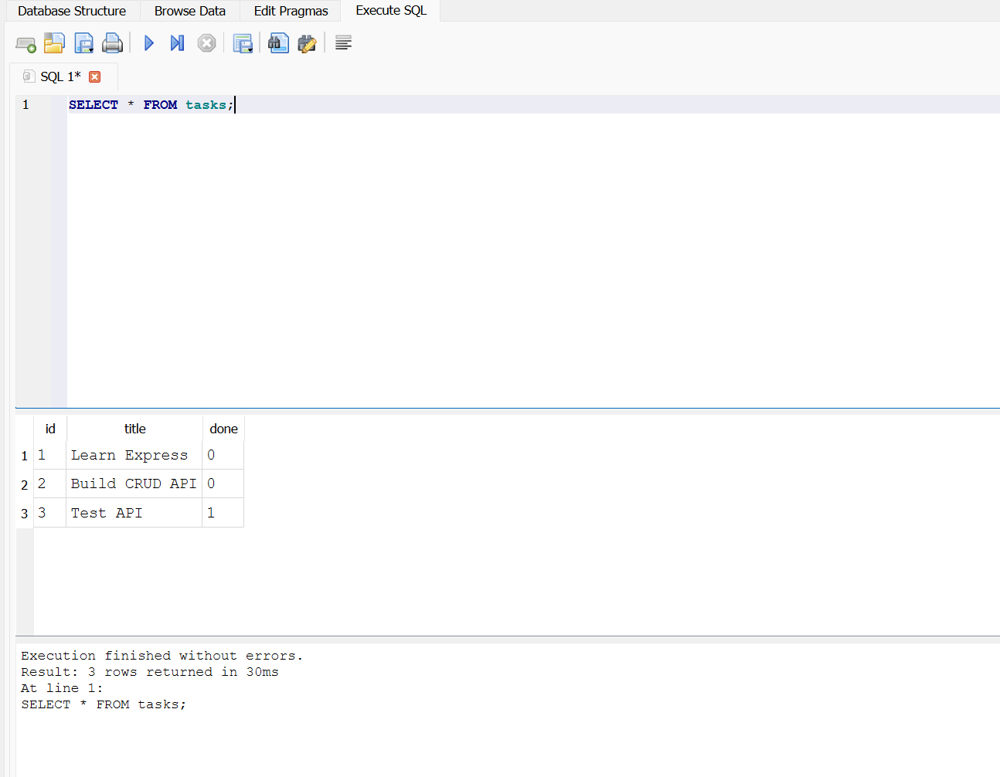

# Build Your First CRUD API

A simple in-memory CRUD API built with Node.js and Express.

## Features

- Create tasks
- Read all tasks
- Read a single task by ID
- Update tasks
- Delete tasks
- Input validation
- Swagger UI documentation
- In-memory storage

## Installation

Clone the repository and install dependencies:

```bash
npm install
```

## Run the Server

```bash
node server.js
```

The API runs at:

```text
http://localhost:3000
```

## Swagger UI

The API can be tested interactively using Swagger UI at:

```text
http://localhost:3000/docs
```


## API Endpoints

| Method | Endpoint | Description |
| --- | --- | --- |
| GET | `/` | API information |
| GET | `/health` | Health check |
| GET | `/tasks` | Get all tasks |
| GET | `/tasks/:id` | Get a task by ID |
| POST | `/tasks` | Create a new task |
| PUT | `/tasks/:id` | Update a task |
| DELETE | `/tasks/:id` | Delete a task |

## Example Request

```bash
curl -i http://localhost:3000/tasks/1
```

Example output:

```text
HTTP/1.1 200 OK
X-Powered-By: Express
Content-Type: application/json; charset=utf-8

{"id":1,"title":"Learn Express","done":false}
```

## Data Storage

This project uses SQLite for persistent task storage. SQLite was chosen because it is lightweight, requires no separate database server, stores data in a single file, and allows task data to survive application restarts.

The database is stored locally in:

```text
tasks.db
```

The database file and the `tasks` table are created automatically when the application starts if they do not already exist.

Three example tasks are inserted only when the `tasks` table is empty. This prevents the seed data from being duplicated when the server restarts.

The `tasks.db` file is excluded from Git using `.gitignore`. When the repository is cloned and the application is started, a new database is created automatically.

## Database Screenshot

The SQLite database can be inspected using DB Browser for SQLite.



## SQLite Query Example

During the database exploration, I ran:

```sql
SELECT * FROM tasks WHERE done = 1;
```

This query returned all completed tasks, demonstrating how SQL can filter rows directly in the SQLite database.

## Technologies

- Node.js
- Express
- Swagger UI
- OpenAPI
- Git
- GitHub