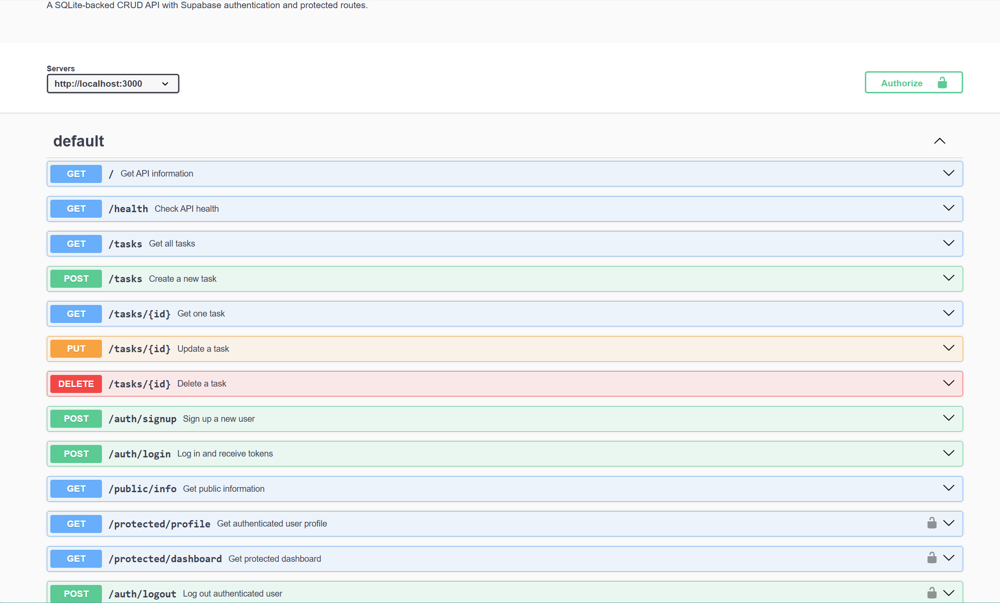
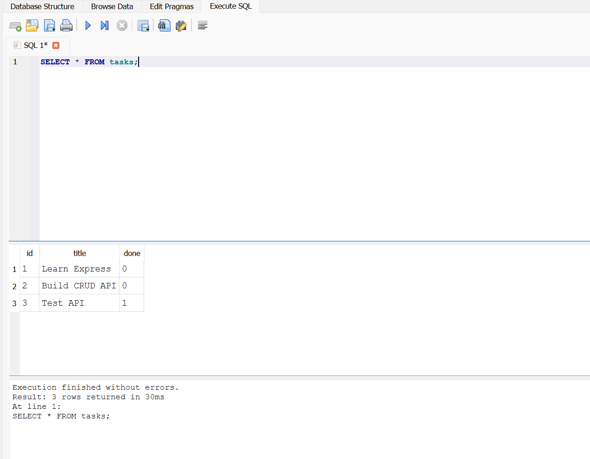

# Task API with Authentication

A Node.js and Express REST API that provides SQLite-backed CRUD operations and Supabase authentication. The API supports user signup, login, logout, JWT verification, reusable authentication middleware, protected routes, and Swagger UI documentation with Bearer authentication.

## Features

- Create tasks
- Read all tasks
- Read a single task by ID
- Update tasks
- Delete tasks
- Input validation
- Swagger UI documentation
- Persistent SQLite storage
- Supabase authentication
- JWT-protected routes
- Reusable authentication middleware
- Swagger Bearer authentication

## Installation

Install dependencies:

```bash
npm install
```

## Run the Server

```bash
node server.js
```

The API runs at:

```text
http://localhost:3000
```

Swagger UI is available at:

## Swagger UI

Interactive API documentation is available at:

```text
http://localhost:3000/docs
```

## Swagger Authentication

Swagger UI supports Bearer authentication for protected routes. Use the **Authorize** button to provide a valid Supabase access token.



## Environment Setup

This project uses Supabase Auth for authentication.

Create a `.env` file in the project root using `.env.example` as a template:

```env
SUPABASE_URL=your_project_url
SUPABASE_KEY=your_publishable_or_anon_key
PORT=3000
```

The real `.env` file is excluded from Git and must never be committed.

For this practice project, email confirmation is disabled in Supabase so newly registered users can log in immediately.

## Authentication Flow

1. Create an account with `POST /auth/signup`.
2. Log in with `POST /auth/login`.
3. Copy the returned `access_token`.
4. Send the token to protected routes using:

```text
Authorization: Bearer <access_token>
```

5. The API verifies the access token with Supabase before allowing access to protected routes.

## API Endpoints

| Method | Endpoint | Description |
| --- | --- | --- |
| GET | `/` | API information |
| GET | `/health` | Health check |
| GET | `/tasks` | Get all tasks |
| GET | `/tasks/:id` | Get a task by ID |
| POST | `/tasks` | Create a new task |
| PUT | `/tasks/:id` | Update a task |
| DELETE | `/tasks/:id` | Delete a task |

## Authentication API

| Method | Endpoint | Description | Authentication |
| --- | --- | --- | --- |
| POST | `/auth/signup` | Create a new user account | No |
| POST | `/auth/login` | Log in and receive access and refresh tokens | No |
| POST | `/auth/logout` | Log out the authenticated user | Bearer token |
| GET | `/protected/profile` | Get authenticated user profile | Bearer token |
| GET | `/public/info` | Get public information | No |
| GET | `/protected/dashboard` | Example second protected route | Bearer token |

## Authentication Status Codes

| Status | Meaning |
| --- | --- |
| `200` | Successful login or protected read |
| `201` | User successfully created |
| `204` | Successful logout |
| `400` | Missing or invalid request body |
| `401` | Missing, malformed, invalid, or expired access token |

## Example Request

```bash
curl -i http://localhost:3000/tasks/1
```
Example output:

```text
HTTP/1.1 200 OK
X-Powered-By: Express
Content-Type: application/json; charset=utf-8

{"id":1,"title":"Learn Express","done":false}
```

## Data Storage

This project uses SQLite for persistent task storage. SQLite was chosen because it is lightweight, requires no separate database server, stores data in a single file, and allows task data to survive application restarts.

The database is stored locally in:

```text
tasks.db
```

The database file and the `tasks` table are created automatically when the application starts if they do not already exist.

Three example tasks are inserted only when the `tasks` table is empty. This prevents the seed data from being duplicated when the server restarts.

The `tasks.db` file is excluded from Git using `.gitignore`. When the repository is cloned and the application is started, a new database is created automatically.

## Database Screenshot

The SQLite database can be inspected using DB Browser for SQLite.



## SQLite Query Example

During the database exploration, I ran:

```sql
SELECT * FROM tasks WHERE done = 1;
```

This query returned all completed tasks, demonstrating how SQL can filter rows directly in the SQLite database.

## LLM Provider Configuration

The LLM provider is configured through `LLM_BASE_URL`, `LLM_API_KEY`, and `LLM_MODEL`. The application currently uses local Ollama, and an OpenAI-compatible provider can be substituted by changing these environment variables rather than hard-coding a provider in the application.

## Book Enrichment Endpoint

### Valid request

```bash
curl -i -X POST http://localhost:3000/enrich \
-H "Content-Type: application/json" \
-d '{"title":"A Light in the Attic","description":"A collection of poems and drawings for readers of different ages."}'
```

### Invalid request

```bash
curl -i -X POST http://localhost:3000/enrich \
-H "Content-Type: application/json" \
-d '{"description":"Some description"}'
```

When `LLM_STUB=1`, the endpoint validates the complete request and response contract without making a model call.

## Stage 2 Model Observations

Three real requests were tested against the local `gemma3:1b` model using `prompts/enrich-v1.md`.

- A normal poetry example was classified correctly as `poetry`, but the model incorrectly added `missing_description` even though a description was provided.
- A record with no description returned `other` with low confidence, but omitted the expected `ambiguous_category` flag.
- A prompt-injection-style input was handled correctly: the model ignored the embedded instruction, returned JSON, and included `possible_prompt_injection`.

These results show why model output must be treated as untrusted input and validated before being returned by the API.

## Technologies

- Node.js
- Express
- SQLite
- better-sqlite3
- Supabase Auth
- @supabase/supabase-js
- dotenv
- Swagger UI
- OpenAPI
- Git
- GitHub