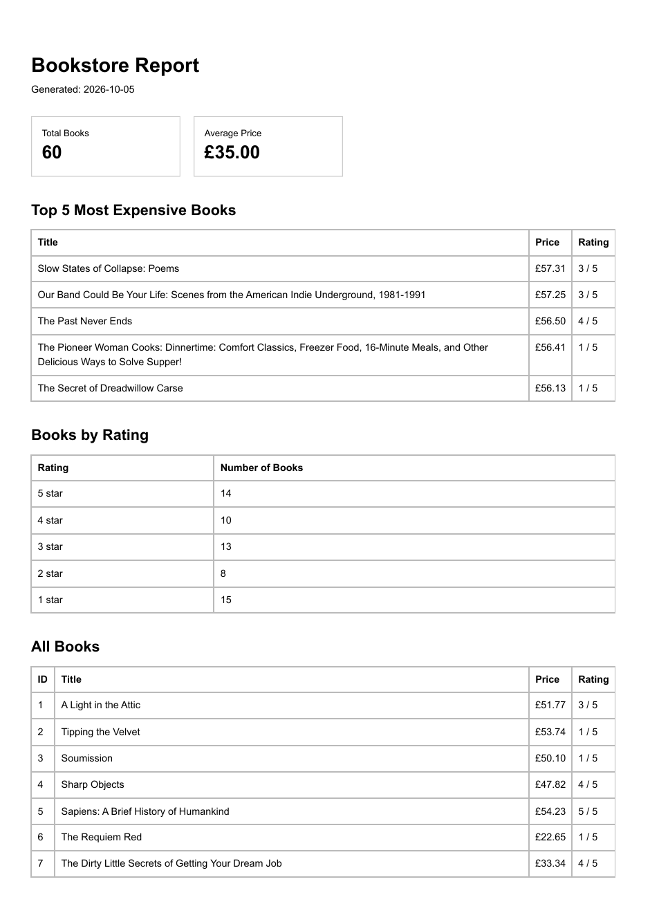

# PDF Report Generator

FlyRank Backend Track — Assignment A8.

This project generates multi-page PDF reports from bookstore data using Node.js, Express, SQLite, and Playwright.

The application follows a simple reporting pipeline:

```text
SQLite data
    ↓
SQL aggregation
    ↓
HTML report
    ↓
Playwright / Chromium
    ↓
PDF file
    ↓
API download link
```

The generated PDF is stored on disk, while the API returns lightweight JSON containing the report ID and file link.

## Dataset

This project uses the **bookstore dataset** option.

The source data comes from the 60 validated book records collected in the earlier polite scraper assignment from Books to Scrape.

The seed script reads:

```text
../scraper/output/books.json
```

and stores the following fields in SQLite:

| Database Column | Source Field |
| --- | --- |
| `title` | `title` |
| `price` | `price_gbp` |
| `rating` | `rating_text`, converted from One–Five to 1–5 |
| `url` | `product_url` |

The SQLite database is generated locally as:

```text
report.db
```

Running the seed script repeatedly remains safe because the existing book rows are cleared before inserting the 60 records again.

## Requirements

- Node.js 22+
- npm
- Playwright Chromium

## Installation

Install project dependencies:

```bash
npm install
```

Install Chromium for Playwright:

```bash
npx playwright install chromium
```

## Seed the Database

Run:

```bash
npm run seed
```

Expected result:

```text
Seed complete: 60 books
```

Running the command again still leaves exactly 60 books.

## Run the API

Start the server:

```bash
npm start
```

The API runs at:

```text
http://localhost:3000
```

Check the server:

```bash
curl -i http://localhost:3000/health
```

Expected response:

```json
{
  "status": "ok"
}
```

## API Endpoints

| Method | Endpoint | Description |
| --- | --- | --- |
| GET | `/health` | Health check |
| POST | `/reports` | Generate a report or reuse today's existing report |
| GET | `/reports/:id` | Get report metadata and file link |
| GET | `/reports/:id/file` | Download the generated PDF |

### Force a New Report

By default, only one report is generated per day.

To explicitly generate a new report even if one already exists:

```bash
curl -i -X POST http://localhost:3000/reports \
-H "Content-Type: application/json" \
-d '{"force":true}'
```

## Aggregation SQL

The bookstore report is built from four aggregation queries.

### Total Number of Books

```sql
SELECT COUNT(*) AS total_books
FROM books;
```

### Average Book Price

```sql
SELECT ROUND(AVG(price), 2) AS average_price
FROM books;
```

### Top 5 Most Expensive Books

```sql
SELECT
  title,
  price,
  rating,
  url
FROM books
ORDER BY price DESC
LIMIT 5;
```

### Number of Books per Rating

```sql
SELECT
  rating,
  COUNT(*) AS count
FROM books
GROUP BY rating
ORDER BY rating DESC;
```

For the current 60-book dataset, the report data produced:

```text
Total books: 60
Average price: £35.00

5-star books: 14
4-star books: 10
3-star books: 13
2-star books: 8
1-star books: 15
```

## PDF Rendering

The report is first built as HTML and then printed to PDF using Playwright and headless Chromium.

The PDF includes:

- generation date
- total number of books
- average price
- top 5 most expensive books
- number of books per star rating
- all 60 books

Print CSS is used to keep table rows intact across page boundaries:

```css
tr {
  break-inside: avoid;
  page-break-inside: avoid;
}
```

The table header is also configured to repeat on later pages:

```css
thead {
  display: table-header-group;
}
```

The resulting report is 3 pages long, with no book rows cut in half and the table header repeated on subsequent pages.

## Generate and Download Proof

Creating a report:

```bash
time curl -i -X POST http://localhost:3000/reports
```

Observed response:

```text
HTTP/1.1 201 Created

{"id":1,"file":"/reports/1/file"}

real    0m2.046s
```

Fetching report metadata:

```bash
curl -i http://localhost:3000/reports/1
```

Observed response:

```json
{
  "id": 1,
  "created_at": "2026-10-05T19:37:33.133Z",
  "file": "/reports/1/file"
}
```

Downloading the generated PDF:

```bash
curl -o my-report.pdf http://localhost:3000/reports/1/file
```

The downloaded file opens as a real 3-page PDF generated from the bookstore data.

An unknown report ID returns:

```bash
curl -i http://localhost:3000/reports/99999
```

```json
{
  "error": "Report not found"
}
```

with HTTP status:

```text
404 Not Found
```

## Stage 4 Observation

PDF generation currently runs synchronously inside the request.

For this small 60-book report, generation took approximately two seconds, which is acceptable for a small workload. I would move report generation to a background job once generation becomes slow enough to make users wait several seconds or when many reports may be requested concurrently.

## Idempotency

The report endpoint implements same-day idempotency.

Two normal requests on the same day reuse the same generated report rather than producing duplicate PDF files.

### Idempotency Proof

First request:

```text
POST /reports
→ 201 Created
→ {"id":2,"file":"/reports/2/file"}
```

Second normal request:

```text
POST /reports
→ 200 OK
→ {"id":2,"file":"/reports/2/file"}
```

Both requests returned the same report ID.

Only one new PDF was produced.

A forced request bypassed the reuse check:

```bash
curl -i -X POST http://localhost:3000/reports \
-H "Content-Type: application/json" \
-d '{"force":true}'
```

Response:

```text
HTTP/1.1 201 Created

{"id":3,"file":"/reports/3/file"}
```

The forced request created a different report ID and a new PDF.

## Stage 5 Observation

The same-day report check protects the application from duplicate PDFs caused by double-clicks, retries, or repeated requests.

In a real system, missing this kind of idempotency protection could cost money by charging a customer twice, sending the same paid email twice, or performing another billable operation more than once.

## Generated PDF Screenshot

Page 1 of the generated bookstore report:



## Useful Development Commands

Test the aggregation queries:

```bash
npm run report:test
```

Generate a local test PDF:

```bash
npm run pdf:test
```

The test PDF is written to:

```text
reports/test.pdf
```

## Generated Files

Generated artifacts are intentionally excluded from Git.

The project `.gitignore` excludes:

```text
report.db
reports/
```

`report.db` is recreated by the seed script, and PDFs are regenerated by the application. Only the source code and the recipe for producing these artifacts belong in the repository.

## Project Structure

```text
pdf-report-generator/
├── docs/
│   └── report-page-1.png
├── scripts/
│   ├── generate-test-pdf.js
│   ├── seed.js
│   └── test-report-data.js
├── src/
│   ├── renderReport.js
│   ├── reportData.js
│   └── reportStore.js
├── reports/                 # generated, ignored by Git
├── .gitignore
├── package.json
├── README.md
├── report.db                # generated, ignored by Git
└── server.js
```

## Technologies

- Node.js
- Express
- SQLite with `node:sqlite`
- SQL aggregation
- Playwright
- Headless Chromium
- HTML
- Print CSS
- Git
- GitHub